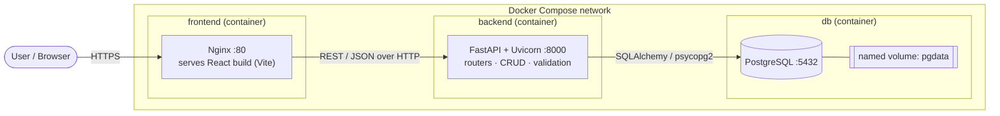
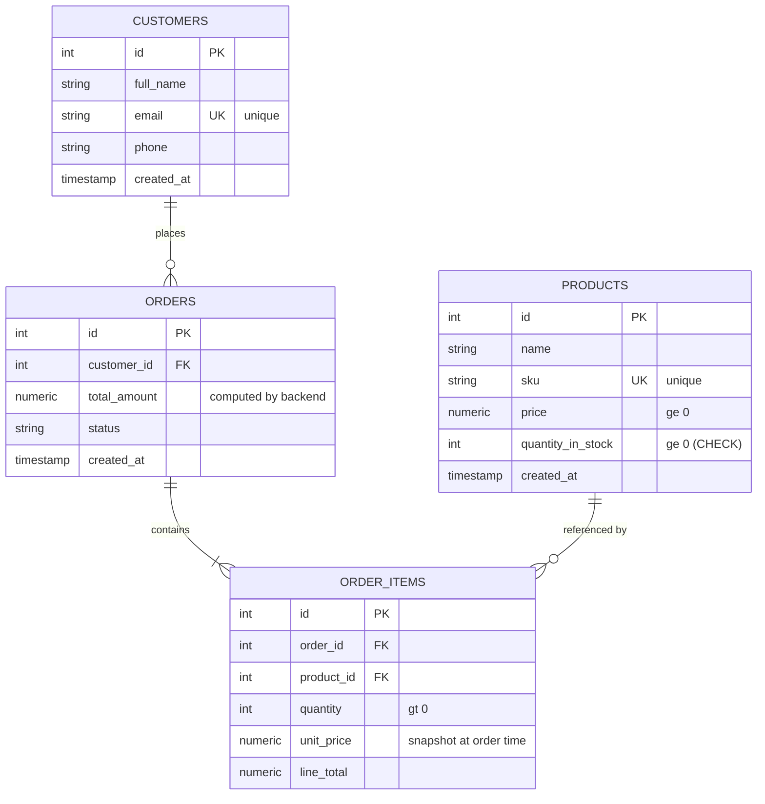
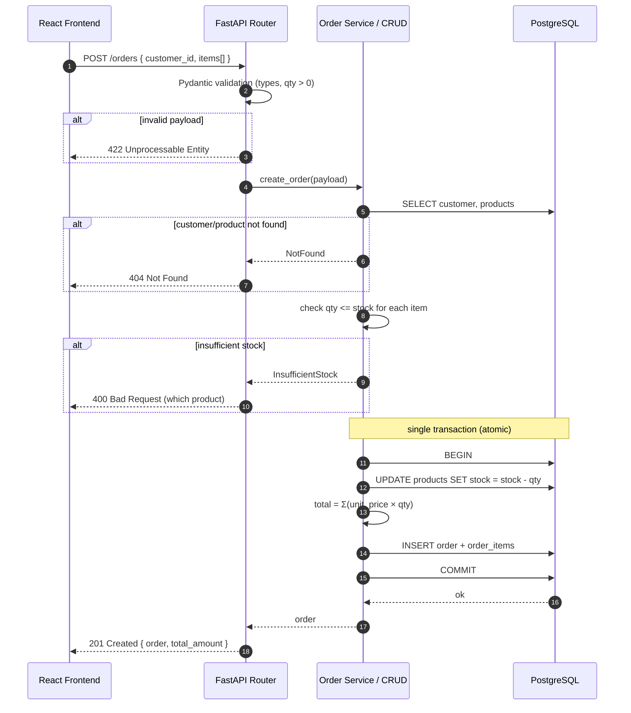
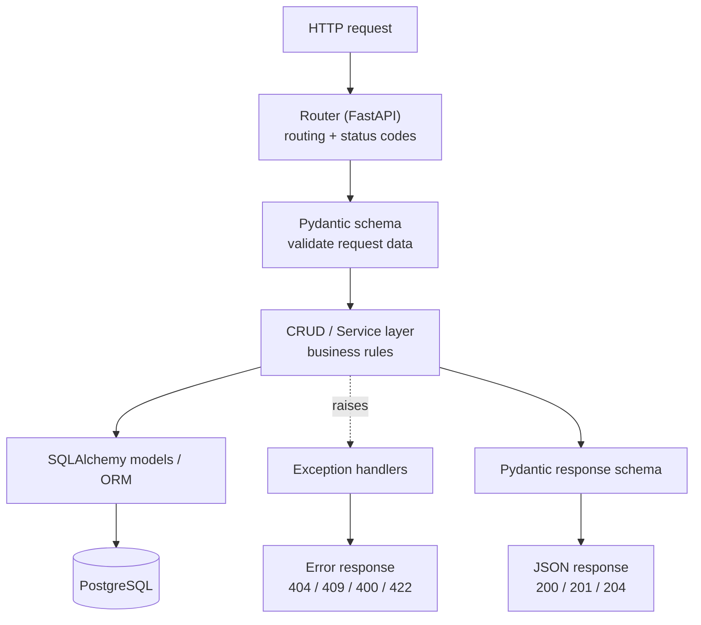
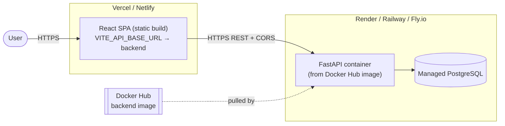
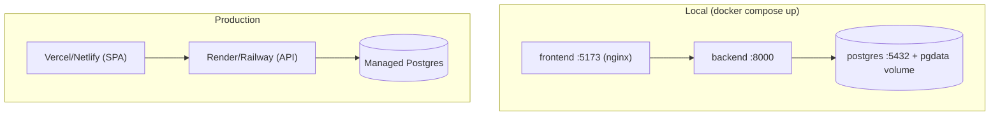

# Architecture — Inventory & Order Management System

Diagrams are written in **Mermaid** and render directly on GitHub and most Markdown viewers. Companion to `IMPLEMENTATION_PLAN.md`.

---

## 1. System / Container Architecture

High-level view of the three Dockerized services and how they talk.

---

## 2. Entity-Relationship Diagram

Header/line-item order model supports multiple products per order.

---

## 3. Order Creation Sequence (with business rules)

Shows validation, the insufficient-stock guard, and the atomic stock-decrement transaction.

---

## 4. Request Flow / Layered Backend

How a request moves through the backend layers.

---

## 5. Deployment Topology (Production)

Free-tier hosting with managed Postgres; frontend and backend on separate platforms.

---

## 6. Local Dev vs Production

| Concern | Local | Production |
|---|---|---|
| Frontend host | nginx container `:5173` | Vercel / Netlify |
| Backend host | container `:8000` | Render / Railway / Fly |
| Database | postgres container + `pgdata` | Managed Postgres |
| API base URL | `http://localhost:8000` | live backend HTTPS URL |
| CORS origins | `http://localhost:5173` | live frontend URL |
| Secrets | root `.env` | platform env-var dashboards |
